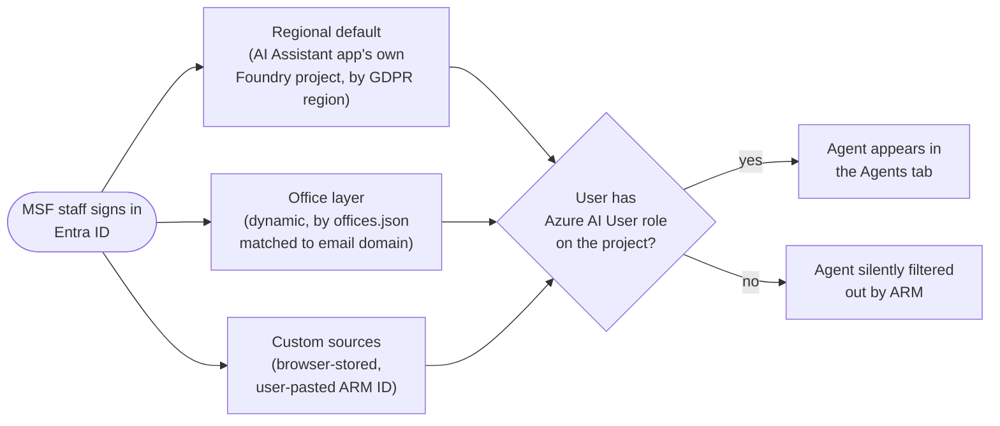
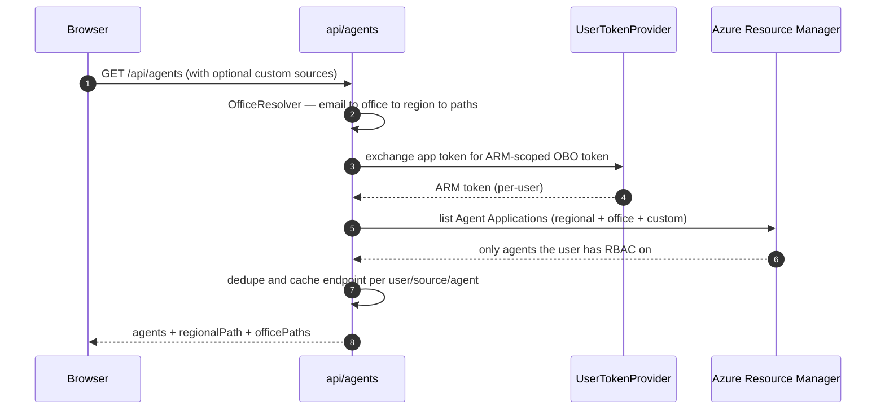
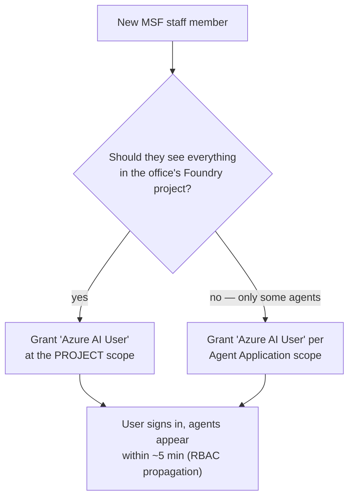
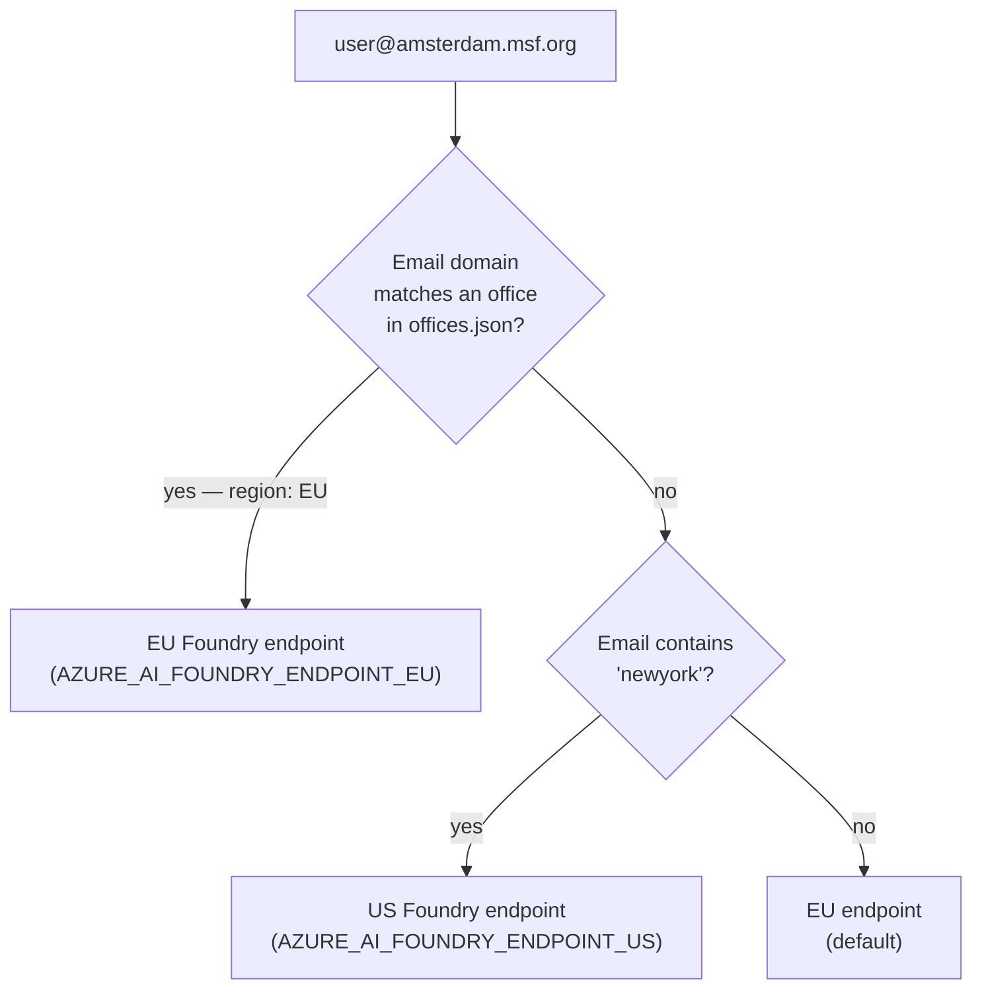

# Agent Access Management

How MSF staff access AI Foundry agents through the AI Assistant app, how MSF offices (sections / OCs) onboard their own Foundry projects, and how teams scope agent access to the right people.

**Audience:** MSF office IT admins, the AI platform team, and anyone wiring up a new Foundry project for their section.

**Out of scope:** authoring agents inside Foundry (see Microsoft Foundry docs); the remote MCP wrapper for external clients (separate project).

---

## The one rule that applies to all three layers

> **Every agent shown to a user is RBAC-filtered server-side using that user's own Entra identity.** A user must be assigned the **Azure AI User** role (or higher) on the relevant Foundry project — or on the specific Agent Application — to see and invoke the agent. There is no exception. This applies equally to the AI Assistant's regional default project, an office's project, and any custom Foundry source a user pastes in themselves.

The three "layers" below differ only in **which projects the app asks ARM about for a given user**. RBAC decides which agents come back from each.

---

## 1. The three layers of agent access

A signed-in user's Agents tab is built from up to three sources. They're additive — a user can have all three at once — and every agent shown has been confirmed RBAC-accessible to that user.



### Regional default — the AI Assistant's own Foundry project

This is the platform team's Foundry project that ships with the AI Assistant app itself. Every signed-in user gets it as their baseline. There are two: one in the EU and one in the US, and the user is routed to one or the other **by GDPR region** (derived from their MSF email — see [§7 Data residency](#7-data-residency)). The agents the platform team builds for general MSF use live here.

The user still needs Azure AI User on that regional project to see anything. In practice the platform team grants this broadly via an Entra group covering all MSF staff using the app.

### Office layer — dynamic, per-office Foundry projects

When an MSF office (e.g. OCA Amsterdam, MSF USA, OCG Geneva) wants its own Foundry project for office-specific agents, it gets registered in `config/offices.json` along with the email domains for that office. At sign-in time the app:

1. Looks at the user's email domain.
2. Finds the matching office entry (most-specific suffix wins).
3. Asks ARM for the agents in that office's Foundry project — **using the user's own Entra token**, so ARM only returns agents the user is authorized for in that office.

Crucially, an office showing up in `offices.json` does **not** grant access — it just makes the office's project a candidate for discovery. The office still controls who actually sees its agents through Azure AI User role assignments on its Foundry project.

### Custom sources — browser-stored, per-user

Any user can manually paste an ARM resource ID for a Foundry project they want to see in their picker (e.g. a colleague at another OC sharing their project, or a sandbox project for a working group). These connections are stored **only in the user's own browser** (in the settings store) and are never shared or synced server-side.

The same Entra-driven RBAC check still runs: a user can paste any path they like, but if they're not Azure AI User on that project, ARM returns nothing and they see an empty connection.

| Layer                | Who configures it        | Where it's stored                                           | Who is offered it                           | Who actually sees agents                              |
| -------------------- | ------------------------ | ----------------------------------------------------------- | ------------------------------------------- | ----------------------------------------------------- |
| **Regional default** | Platform team            | `AZURE_AI_FOUNDRY_RESOURCE_ID_US` / `_EU` env vars          | Every signed-in user (one region)           | Anyone with Azure AI User on that regional project    |
| **Office**           | Office IT (PR + env var) | `config/offices.json` + `OFFICE_<NAME>_FOUNDRY_PROJECT_IDS` | Users whose email domain matches the office | Anyone with Azure AI User on that office's project    |
| **Custom**           | The user themselves      | Their browser (`settingsStore`)                             | Only the user who added it                  | The same user, if Azure AI User on the pasted project |

---

## 2. How access is actually decided

Discovery happens server-side on every request to `GET /api/agents`. The flow:



Three things make this RBAC-correct rather than just RBAC-shaped:

1. **OBO tokens, not the app's identity.** The user's own access token is exchanged for a delegated token. ARM evaluates RBAC against the _user_, not the app. In production, OBO failure returns an empty list — there is no silent fallback to the app's identity, which would otherwise leak the union of every agent in the tenant to every user.
2. **Strict ARM path validation.** Custom source paths from the query string are matched against a regex that only accepts `Microsoft.CognitiveServices/accounts/{name}[/projects/{name}]` shapes. Invalid entries are dropped silently — no SSRF surface.
3. **Per-user endpoint cache.** When discovery succeeds, the resolved Foundry endpoint for each (user, source, agent) is cached server-side. The chat path _never_ trusts a `foundryEndpoint` field from the request body; it looks up the endpoint from the cache, then re-validates against a strict host allowlist before attaching the user's bearer token. This means a user can't trick the server into POSTing their OBO token to an attacker-controlled host.

> **Note:** First-load latency is dominated by the ARM list call and the OBO exchange. Both are cached (5 min for agent lists, 1h for OBO tokens with a 5-minute safety buffer). The "Refresh" button in the Agents tab passes `?refresh=1` to bust the server-side discovery cache.

---

## 3. Onboarding a new MSF office

You'll do this once per office when bringing a new section onto the AI Assistant. End-to-end it takes about 30–60 minutes including RBAC propagation. The example below uses **OCG Geneva** as a worked example; substitute your office.

### 3.1 Prerequisites

- An Azure subscription your office controls, where you have **Owner** or **User Access Administrator**
- Ability to open a PR against this repo
- Coordination with the AI platform team to set the office's env var in dev / live / beta deployments

### 3.2 Provision the Foundry resource

In your office's Azure subscription, in the region that matches your GDPR declaration (EU sections → an EU region; MSF USA → a US region):

1. Create a **Microsoft.CognitiveServices/accounts** resource of kind "AIServices" (this is the Azure AI Foundry resource in the portal).
2. Inside that account, create one or more **projects**. The full ARM path you'll need looks like:

   ```
   /subscriptions/<sub-id>/resourceGroups/<rg>/providers/Microsoft.CognitiveServices/accounts/<account>/projects/<project>
   ```

3. Create your Agent Applications inside the project (see Microsoft's Foundry docs for the agent-authoring side).
4. Add ARM resource tags on each Agent Application for UI metadata — see [§6 Agent metadata via tags](#6-agent-metadata-via-tags).

### 3.3 Wire the office into the AI Assistant — two PRs

Onboarding an office requires changes in **two repos**: [`ai-assistant-app`](https://github.com/Medecins-Sans-Frontieres-Collaborate/ai-assistant-app) for the office definition, and [`ai-assistant-terraform`](https://github.com/Medecins-Sans-Frontieres-Collaborate/ai-assistant-terraform) for the env var that actually exposes the Foundry project ID to the running container.

#### PR 1: [`ai-assistant-app`](https://github.com/Medecins-Sans-Frontieres-Collaborate/ai-assistant-app) — add the office definition

Add an entry to [`config/offices.json`](https://github.com/Medecins-Sans-Frontieres-Collaborate/ai-assistant-app/blob/main/config/offices.json):

```json
{
  "id": "ocg-geneva",
  "displayName": "OCG Geneva",
  "emailDomains": ["geneva.msf.org"],
  "region": "EU",
  "foundryProjectsEnv": ["OFFICE_OCG_GENEVA_FOUNDRY_PROJECT_IDS"]
}
```

| Field                | Notes                                                                                                                              |
| -------------------- | ---------------------------------------------------------------------------------------------------------------------------------- |
| `id`                 | Stable kebab-case identifier; don't change after the fact (analytics & logs key off this)                                          |
| `displayName`        | Section header users see in the Agents tab — e.g. "OCG Geneva Agents"                                                              |
| `emailDomains`       | Array. Most-specific match wins, so list any subdomain explicitly. Real example: MSF USA uses `["newyork.msf.org", "msf-usa.org"]` |
| `region`             | `"US"` or `"EU"` — controls GDPR data residency for chat traffic                                                                   |
| `foundryProjectsEnv` | Array of env var **names** that hold comma-separated ARM resource paths                                                            |

Also add a placeholder line to `.env.example` so local devs know the var exists:

```bash
OFFICE_OCG_GENEVA_FOUNDRY_PROJECT_IDS=/subscriptions/.../projects/ocg-agents
```

The env var holds a **comma-separated** list — you can register more than one project per office:

```bash
OFFICE_OCG_GENEVA_FOUNDRY_PROJECT_IDS=/subscriptions/.../projects/ocg-finance,/subscriptions/.../projects/ocg-hr
```

#### PR 2: [`ai-assistant-terraform`](https://github.com/Medecins-Sans-Frontieres-Collaborate/ai-assistant-terraform) — wire the env var into the Container Apps

Without this PR, the JSON entry from PR 1 resolves to an empty project list at runtime and the office won't appear. Three files need edits:

**1.** [`terraform/root_modules/compute/vars.tf`](https://github.com/Medecins-Sans-Frontieres-Collaborate/ai-assistant-terraform/blob/main/terraform/root_modules/compute/vars.tf) — declare a new variable, mirroring the existing `ai_foundry_project_resource_id_us` / `_eu` pattern:

```hcl
variable "ai_foundry_project_resource_id_ocg_geneva" {
  description = "ARM resource path for the OCG Geneva AI Foundry project. Used for office-scoped agent discovery."
  type        = string
}
```

**2.** [`terraform/root_modules/compute/container_apps.tf`](https://github.com/Medecins-Sans-Frontieres-Collaborate/ai-assistant-terraform/blob/main/terraform/root_modules/compute/container_apps.tf) — add an `env` block in **each of the three** `azurerm_container_app` resources (`dev`, `live`, `beta`). Drop it next to the existing `AZURE_AI_FOUNDRY_RESOURCE_ID_EU` / `_US` blocks:

```hcl
env {
  name  = "OFFICE_OCG_GENEVA_FOUNDRY_PROJECT_IDS"
  value = var.ai_foundry_project_resource_id_ocg_geneva
}
```

> **Note:** The three `azurerm_container_app` resources are dev / live / beta. Add the `env` block to all three unless you have a reason to scope the office to a single environment (e.g. piloting in beta before going to live).

**3.** Each environment's tfvars file — set the actual value alongside the existing `ai_foundry_project_resource_id_us` / `_eu` lines:

- [`terraform/envs/dev/dev.tfvars`](https://github.com/Medecins-Sans-Frontieres-Collaborate/ai-assistant-terraform/blob/main/terraform/envs/dev/dev.tfvars)
- [`terraform/envs/live/live.tfvars`](https://github.com/Medecins-Sans-Frontieres-Collaborate/ai-assistant-terraform/blob/main/terraform/envs/live/live.tfvars)

```hcl
ai_foundry_project_resource_id_ocg_geneva = "/subscriptions/.../projects/ocg-agents"
```

> **Why the split between two repos?** The app code needs to know an office _exists_ so the UI can render its section header, but the actual ARM resource ID is environment-specific (different in dev vs live) and contains subscription IDs we manage as Terraform state rather than as committed JSON. Same pattern the regional defaults already use.

### 3.4 Grant the "Azure AI User" role on the Foundry project

This is what actually lets users see agents. Without this, your staff will sign in, see the "OCG Geneva Agents" header, and find it empty.

```bash
# Minimum role for an end user to discover and invoke agents
az role assignment create \
  --assignee <entra-group-or-user-object-id> \
  --role "Azure AI User" \
  --scope <office-foundry-project-arm-path>
```

**Best practice:** create one Entra group per office (e.g. `msf-ai-users-ocg-geneva`), assign the role to the group at the project scope, manage membership in Entra. Avoid per-user role assignments — they don't scale across hundreds of staff and they're easy to forget on offboarding.

### 3.5 Verify

Once the change is live in the target environment and the env var is set on the container app:

1. Have a test user from your office sign in to the AI Assistant.
2. Open the model picker → Agents tab.
3. Confirm an "OCG Geneva Agents" section appears alongside "EU Region Agents" (or "US Region Agents" for MSF USA).
4. Confirm the user can start a chat with one of the agents and gets a real response.

If something's off, see [§8 Troubleshooting](#8-troubleshooting).

---

## 4. Onboarding staff to specific agents

You have two scopes for granting access. Pick the one that matches your governance model.



**Project-scope grant** is appropriate when an office's Foundry project is curated and everyone in the office should see everything in it. Simplest to manage; this is what most offices use.

**Agent-Application-scope grant** is appropriate when a single project hosts agents owned by different teams (Finance, HR, Legal) and each team's agents should only be visible to that team. The role can be assigned at the child Agent Application resource — the ARM list call honors that and only returns the apps the user can read.

Either way, the user does **not** need any role on the regional default project — they're only ever shown agents the office decides to expose to them, plus regional defaults granted by the platform team.

### Group-based access (recommended)

Create one Entra group per logical access tier:

| Group                   | Scope                       | Role          |
| ----------------------- | --------------------------- | ------------- |
| `msf-ai-users-<office>` | Office Foundry project      | Azure AI User |
| `msf-ai-team-<team>`    | Specific Agent Applications | Azure AI User |

Add and remove members in Entra. New members see access propagate within Azure's normal RBAC propagation window (typically <5 minutes). Use the Refresh button in the Agents tab if a user needs to see a change immediately.

---

## 5. Custom user sources

End users with the right permissions in another Foundry project can connect that project themselves without a code change:

1. In the model picker, **Agents** tab → **Add Foundry connection**.
2. Paste the ARM resource path (`/subscriptions/.../projects/...`).
3. Give it a display name.
4. Save.

The path is validated against the strict regex described in §2. The connection is stored in the user's local settings only — it is not shared with other users and not synced server-side. RBAC still applies: if the user doesn't have Azure AI User on that project, the connection will succeed but the agent list will be empty.

This is the right tool for ad-hoc cross-office collaboration ("show me the Geneva office's agents in my picker") and for proof-of-concept Foundry projects that aren't ready to be a permanent office config entry yet.

> **Note:** Custom sources do not change the user's region or where their chat traffic is routed. They simply add another bucket of agents to discovery.

---

## 6. Agent metadata via tags

The UI pulls icons, colors, categories, and ownership labels from **ARM resource tags** on each Agent Application. Set these in the Foundry portal (or via Terraform / `az tag`) when you publish an agent.

| Tag                | Purpose                                               | Example                      |
| ------------------ | ----------------------------------------------------- | ---------------------------- |
| `ui-icon`          | Tabler icon name                                      | `IconCurrencyDollar`         |
| `ui-color`         | Hex color for the agent badge                         | `#4190f2`                    |
| `ui-image`         | Cover image path served from `/public/images/agents/` | `/images/agents/finance.jpg` |
| `ui-category`      | Grouping label in the picker                          | `Finance`                    |
| `ui-maintained-by` | Free-text owner label                                 | `Amsterdam Finance Team`     |

Missing tags fall back to the default outline-hexagon icon and the default blue. There's no validation pass — typos give you defaults silently, so double-check the Tabler icon names against [tabler.io/icons](https://tabler.io/icons).

> **Note:** Cover images currently must be committed to this repo under `public/images/agents/` and shipped with the app. If you need a new image, add it in a PR.

---

## 7. Data residency

Region selection is **derived from the user's MSF email domain**, not from where they connect. A user from OCA Amsterdam traveling to New York still has their chat traffic routed to the EU Foundry resource — that's the point.



**What region controls:**

- Which Foundry endpoint user prompts and responses are sent to (data residency for chat content)
- Which regional default project's agents are auto-discovered
- Which Blob Storage account is used for uploaded files

**What region does NOT control:**

- RBAC (that's per-resource, region-agnostic — an OCA user can have Azure AI User on a US-hosted office project and use those agents)
- Office-scoped agents (OCA could register a project hosted in the US, though we strongly recommend matching to keep GDPR audits simple)
- Custom user sources (added by the user; they choose where their data goes)

For a new MSF office onboarding, **`region` in `offices.json` should match the geography of the Foundry resource you're registering** unless you have a specific compliance reason to do otherwise. EU-section users (OCA, OCB, OCG, MSF Spain, etc.) should normally be on EU; MSF USA on US. Mismatches cause confusing latency and complicate the GDPR story when legal asks.

---

## 8. Troubleshooting

### "User sees no agents at all"

Walk down this list in order:

1. **Did the user actually sign in to the right tenant?** Check `session.user.mail` is populated. No mail → no office match → empty list.
2. **Is the regional default env var set?** `AZURE_AI_FOUNDRY_RESOURCE_ID_US` / `_EU` for the user's region. Empty → that bucket of agents doesn't show.
3. **Does the user have Azure AI User on the project?** Without RBAC, ARM returns nothing. Test in the Azure portal: the user should be able to load the project's Applications blade.
4. **Is OBO working?** In dev, the server logs `[/api/agents] OBO failed (dev), using fallback credential`. In prod, OBO failure returns an empty list silently — check `[/api/agents] OBO failed for <user>` in container logs. Fix: confirm the app registration has admin-consented permissions for the Azure AI Foundry and Azure Service Management APIs.
5. **Click Refresh.** Server-side cache is 5 min; a recent RBAC grant may not have flushed yet.

### "User sees the wrong office's agents / their office is missing"

- `OfficeResolver` matches by email domain; **most-specific suffix wins**. If a user's email is `alice@subdomain.msf.org` and you have entries for both `msf.org` and `subdomain.msf.org`, the longer match wins.
- The legacy fallback: emails containing `newyork` get region `US` even without an office match. This is preserved for back-compat with pre-`offices.json` URLs and email aliases. If it's catching unintended users, add an explicit office entry to override.

### "User got a 403 from chat"

- They have RBAC for _discovery_ (Azure AI User on the project / app) but not for _invocation_. Confirm the role is Azure AI User and not a read-only built-in role.
- The OBO token may be stale. Sign out and back in.

### "I added an agent but the icon is wrong / there's no description"

- Tags only sync at discovery time. Click Refresh.
- Check that tags are on the **Agent Application** resource, not on the parent project or account.
- Check the Tabler icon name capitalization. `IconCurrencyDollar` works; `iconcurrencydollar` does not.

### "I added an office to `offices.json` but nothing shows up"

- Did you also set `OFFICE_<NAME>_FOUNDRY_PROJECT_IDS` in the deployed env, not just `.env.example`?
- The env var must be set in the **container app** for the target environment (dev / live / beta), not just locally.
- Confirm the value passes the ARM path regex — the most common mistake is a trailing slash or leftover whitespace.

### "Refresh button doesn't seem to do anything"

- It clears the server-side discovery cache for _all_ users in this container instance, then re-runs discovery for the current user. If you have multiple container replicas, only the one your request hits is cleared. Wait 5 min for the others to expire naturally, or have someone restart the container app.

---

## 9. What's not covered here

- **Authoring agents inside Foundry** — see Microsoft's Azure AI Foundry documentation. We don't shadow it.
- **The MCP Foundry wrapper** — exposing these same agents to external MCP clients (Claude Enterprise, Claude Desktop). That's a separate project; if it's relevant to your office, ask the platform team.
- **Per-conversation RBAC** — there isn't any. RBAC is checked at discovery and at chat invocation; there's no further check on individual messages within a conversation.
- **Audit logging** — Azure AI Foundry's own audit logs are the source of truth for which user invoked which agent and when. We don't duplicate that.

---

## 10. Quick reference

**Add an office** → PR to `config/offices.json` + env var `OFFICE_<NAME>_FOUNDRY_PROJECT_IDS` + RBAC grant on the Foundry project.

**Add a user to an office's agents** → Add to the office's Entra group (which has Azure AI User on the Foundry project).

**Restrict a user to specific agents** → Grant Azure AI User at the **Agent Application** scope, not the project scope.

**Force a user's agent list to refresh** → Refresh button in the Agents tab, or sign out + back in.

**Add a one-off Foundry connection for yourself** → Agents tab → Add Foundry connection → paste ARM path.

**Configure agent appearance** → Set ARM resource tags (`ui-icon`, `ui-color`, `ui-category`, `ui-maintained-by`, `ui-image`) on the Agent Application.
