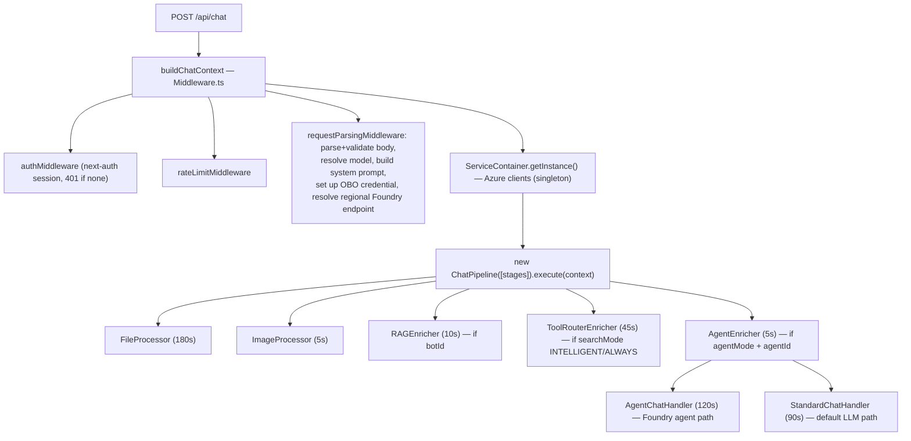
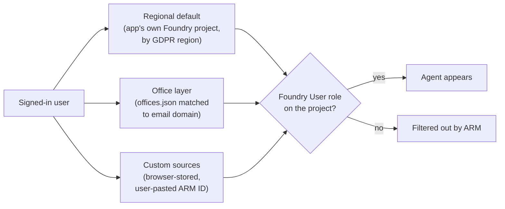
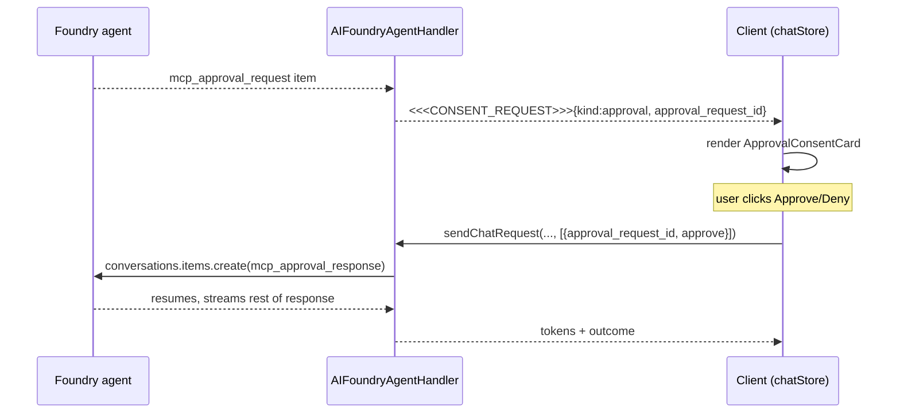

# Architecture: Chat Pipeline, Agent Access & MCP Consent

How the AI Assistant is built end to end, with emphasis on the chat pipeline, agent access (authentication + discovery), and the MCP tool-consent flow. Line numbers reference current source; symbol names are given alongside so anchors survive edits.

Two subsystems get the deepest treatment:

1. **Agent access** — every agent a user sees is RBAC-filtered server-side using _their own_ Entra identity (OBO tokens), with agents discovered dynamically from Foundry projects across three "layers." Operational/onboarding detail lives in [`AGENT_ACCESS_MANAGEMENT.md`](./AGENT_ACCESS_MANAGEMENT.md); this doc covers the code paths.
2. **MCP consent** — Foundry agents can call MCP tools. Some calls need explicit user approval, and some connectors need an OAuth sign-in first. Both are surfaced mid-stream as inline cards via a small in-band "stream marker" protocol.

---

## 0. The request spine (trace one request)

Read these top-to-bottom to follow a whole chat request; the sections below expand each part.

```
POST /api/chat                                  app/api/chat/route.ts:67
 ├─ wrap response in a TransformStream so the    route.ts:102-115
 │  pre-stream stages can flush AGENT_ACTIVITY markers live
 │  (5-min request timeout guards the whole thing  route.ts:70)
 ├─ buildChatContext(req)                         lib/services/chat/pipeline/Middleware.ts:511
 │   ├─ authMiddleware                            Middleware.ts:67    401 if no session
 │   ├─ requestParsingMiddleware                  Middleware.ts:119   validate body; parse approvalResponses (:155)
 │   ├─ createRateLimitMiddleware                 Middleware.ts:89    100 req/min
 │   ├─ createSystemPromptMiddleware              Middleware.ts:246
 │   ├─ createContentAnalysisMiddleware           Middleware.ts:224
 │   ├─ createModelSelectionMiddleware            Middleware.ts:470   sets agentMode
 │   └─ createCredentialMiddleware                Middleware.ts:290   OBO + endpoint (Foundry agents only)
 ├─ ServiceContainer.getInstance()                route.ts:135        Azure clients, singleton
 ├─ new ChatPipeline([...stages]).execute()       route.ts:150 → ChatPipeline.ts:90
 │     FileProcessor → ImageProcessor →
 │     RAGEnricher → ToolRouterEnricher → AgentEnricher →
 │     AgentChatHandler → StandardChatHandler     route.ts:150-171  (agent handler runs first, standard is fallback)
 │       └─ AIFoundryAgentHandler                 lib/services/chat/AIFoundryAgentHandler.ts  (agent path; MCP consent)
 └─ pipe handler body through the transform       route.ts:266-290  (abort writer on early error, :295)
```

Two things to note from `route.ts`: the `TransformStream` is built _inside_ the async block so an early auth/validation error returns plain JSON without leaking a transform (`route.ts:95-106`), and `context.emitActivity` (`route.ts:121`) is what lets slow pre-stream stages show live loader text.

---

## 1. App at a glance

`msf-ai-assistant` v2 — a multi-model AI chat product for MSF staff.

| Concern      | Choice                                                                                  |
| ------------ | --------------------------------------------------------------------------------------- |
| Framework    | Next.js 16, App Router (`app/[locale]/`, route groups, route handlers under `app/api/`) |
| Language     | TypeScript, React 19                                                                    |
| Auth         | next-auth v5 (beta), Microsoft Entra ID (Azure AD) only                                 |
| State        | Zustand 5 (`client/stores/`, most persisted to localStorage)                            |
| i18n         | next-intl (`messages/*.json`, locale prefix hidden via cookie)                          |
| AI backends  | Azure OpenAI, Anthropic-via-Foundry, Azure AI Agents / Projects, OpenAI-compatible      |
| RAG / search | Azure AI Search; Bing for web search                                                    |
| Tests        | Vitest (node + jsdom configs), Testing Library                                          |

**Top-level layout**

| Dir           | What                                                                             |
| ------------- | -------------------------------------------------------------------------------- |
| `app/`        | Routes. `[locale]/(chat)` is the main shell; `app/api/*` are the server handlers |
| `components/` | React UI, grouped by feature (Chat, ModelSelect, Settings, …)                    |
| `lib/`        | Server + shared logic: `services/`, `utils/`, `streamMarkers/`                   |
| `client/`     | Client-only: `stores/` (Zustand), `hooks/`, `handlers/`                          |
| `config/`     | `environment.ts`, `offices.json`, model/agent definitions                        |
| `types/`      | Shared interfaces (`chat.ts`, `openai.ts`, …)                                    |

> For the in-depth directory map and the patterns behind it, see **§9**. For key libraries and where they're used, see **§10**.

**Major features:** multi-model chat, Foundry agents, org "bots", RAG/knowledge bases, AI-routed web search, file upload + extraction, audio/video transcription (Whisper + batch), TTS, code & document artifacts, citations, prompts & tones libraries, conversation export, cross-conversation search.

---

## 2. The chat pipeline (server side)

Entry: `app/api/chat/route.ts` (`POST /api/chat`) — one endpoint for all chat modes. The response is a streamed `text/plain` body (gzip disabled, `X-Accel-Buffering: no`) so tokens and markers flush in real time.



Key files:

- `lib/services/chat/pipeline/Middleware.ts` — three middleware fns build the initial `ChatContext` (auth, rate limit, request parsing). OBO credential + regional Foundry endpoint resolution happen here.
- `lib/services/chat/pipeline/ChatContext.ts` — the single mutable state object threaded through every stage.
- `lib/services/chat/pipeline/ChatPipeline.ts` — orchestrator. **Per-stage timeouts** (`STAGE_TIMEOUTS`, `ChatPipeline.ts:29`) and **graceful degradation**: a stage that times out or throws is logged into `context.errors` and skipped; the pipeline continues. `FileProcessor` failures additionally strip `file_url` content so downstream LLMs don't choke (`sanitizeFileUrlsOnError`, `ChatPipeline.ts:298`).
- `lib/services/ServiceContainer.ts` — singleton owning the Azure SDK clients, created once at cold start.

**Enrichers** mutate context before a handler runs:

| Enricher             | Runs when                                       | Effect                                                                                |
| -------------------- | ----------------------------------------------- | ------------------------------------------------------------------------------------- |
| `RAGEnricher`        | `botId` set                                     | Queries Azure AI Search, injects retrieved docs + org-agent system prompt + citations |
| `ToolRouterEnricher` | `searchMode` INTELLIGENT/ALWAYS                 | AI-judge decides if web search is needed; runs Bing; injects results                  |
| `AgentEnricher`      | `agentMode` + `model.agentId` + no files/images | Sets `executionStrategy='agent'`; else downgrades to intelligent search               |

**Handlers** produce the response: `AgentChatHandler` → `AIFoundryAgentHandler` (Foundry Agents API, streaming, MCP consent), or `StandardChatHandler` → backend chosen by `model.sdk` (Azure OpenAI / Anthropic-Foundry / DeepSeek / OpenAI-compatible).

---

## 3. Authentication & identity

next-auth v5 with Entra ID as the sole provider; JWT session strategy.

- On sign-in (`auth.ts`), the app pulls the user's profile from Microsoft Graph (`displayName`, `jobTitle`, `department`, `mail`).
- The JWT deliberately **does not** store the access token (keeps the cookie small); it holds the refresh token and re-acquires access tokens on demand, refreshing silently within ~5 min of expiry.
- `OfficeResolver.getRegionForUser()` maps email → office → **GDPR region (US/EU)**, which decides the Foundry data-plane endpoint, regional default project, and blob storage account.

### On-Behalf-Of (OBO) — the core of RBAC correctness

`lib/services/auth/UserTokenProvider.ts` exchanges the user's app-scoped access token for delegated tokens:

- **Foundry**, scope `https://ai.azure.com/user_impersonation` (`UserTokenProvider.ts:6`) — used to invoke agents _as the user_ and to enrich agent metadata from the data plane.
- **ARM**, scope `https://management.azure.com/.default` (`UserTokenProvider.ts:7`) — used to _list_ agents so ARM returns only what the user has RBAC for.

Tokens are cached per-user (`hashToken(token):purpose` key) with a 5-min safety buffer (`UserTokenProvider.ts:73`). **The OBO token, not the app's identity, is what makes ARM evaluate RBAC against the user.** In prod, OBO failure returns an empty list — never a fallback to the app identity, which would leak the union of all tenant agents to everyone (`app/api/agents/route.ts:107-118`). Dev allows a `ChainedTokenCredential` fallback so local devs without OBO can still exercise discovery.

The minimum role a user needs is **Foundry User** (role id `53ca6127-db72-4b80-b1b0-d745d6d5456d`, formerly "Azure AI User") on the relevant project or Agent Application. See `AGENT_ACCESS_MANAGEMENT.md` for onboarding mechanics.

---

## 4. Agent discovery & refresh

`GET /api/agents` (`app/api/agents/route.ts`) builds a user's agent list from **three additive layers**, all RBAC-filtered:



Request flow (`app/api/agents/route.ts`):

1. `OfficeResolver.getDiscoveryPathsForUser(session.user.mail)` → `regionalPath` + `officePaths` (`route.ts:41`). Offices come from `config/offices.json` + `OFFICE_<NAME>_FOUNDRY_PROJECT_IDS` env vars; most-specific email-domain suffix wins (`OfficeResolver.ts:60`). An entry in `offices.json` only makes a project a _discovery candidate_ — it grants nothing; ARM + OBO is the access gate, and RBAC is region-agnostic.
2. Custom `?sources=` paths are validated against a strict ARM-path regex (`isValidFoundryResourcePath`); invalid entries are dropped silently — **no SSRF surface** (`route.ts:47-58`).
3. Paths are deduped, then discovered in parallel via OBO ARM token (`Promise.allSettled`, `route.ts:144`). Failures per source are skipped, not fatal.
4. **`?refresh=1` busts the server-side discovery cache** (`AgentDiscoveryService.clearCache()`, `route.ts:77`). This is what the "Refresh" button in the Agents tab hits. Caches: ~5 min for agent lists, 1 h for OBO tokens. Note: a refresh clears the cache only on the _replica that served the request_ — other replicas expire naturally within ~5 min.
5. **Per-user endpoint cache as trust anchor** (`route.ts:179-194`): for each discovered `(user, agent, source)`, the resolved `foundryEndpoint` is cached server-side. The chat path **never trusts a `foundryEndpoint` from the request body** — it looks it up from this cache and re-validates against `foundryHostAllowlist` before attaching the user's bearer token.

Metadata: icons/colors/categories come from **ARM resource tags** (`ui-icon`, `ui-color`, `ui-category`, `ui-maintained-by`, `ui-image`); description/version come from the **Foundry data plane** (best-effort enrichment via the Foundry OBO token). Missing tags fall back to a default hexagon + blue.

Client side: `client/hooks/settings/useFoundryAgents.ts` fetches and exposes `isRefreshing`; `components/Chat/ModelSelect/AgentsTab.tsx` renders the three sections + Refresh button + add/edit/disconnect for custom connections (`AgentSourceForm.tsx`).

---

## 5. MCP consent

Foundry agents can invoke MCP tools. Two things may need the user's involvement, surfaced **inline in the assistant message** as cards:

- **OAuth consent** (`kind: 'oauth'`) — a connector needs the user to sign in once (e.g. an external SaaS) before any tool runs.
- **Tool-call approval** (`kind: 'approval'`) — the agent wants to call a specific MCP tool; policy requires explicit per-call consent.

### 5.1 Stream markers — the in-band protocol

`lib/streamMarkers/index.ts` is the single source of truth. Rather than maintaining a second SSE channel, structured events are embedded in the same text stream as sentinel-wrapped JSON — this keeps model tokens and structured events strictly ordered in one stream. Markers are padded with `\n\n` so they never corrupt the markdown renderer:

```
<<<KIND>>>{json-payload}<<<END_KIND>>>
```

| Marker            | Direction     | Lifetime    | Purpose                                                                                    |
| ----------------- | ------------- | ----------- | ------------------------------------------------------------------------------------------ |
| `AGENT_ACTIVITY`  | server→client | transient   | Loader text ("Calling tool…"); only the latest matters, all stripped before render         |
| `CONSENT_REQUEST` | server→client | persistent  | OAuth or approval prompt; survives in message content, rendered as a `ConsentCard`         |
| `CONSENT_OUTCOME` | server→client | side-effect | Server-side resolution (e.g. auto-deny); flips a card's UI without a reload, then stripped |

Emit helpers (`emitAgentActivity` / `emitConsentRequest` / `emitConsentOutcome`) run server-side; parse helpers (`extractLatestAgentActivity` / `extractConsentRequests` / `extractConsentOutcomes`) run client-side and return both payloads and a cleaned string. `stripIncompleteStreamMarkers` (`index.ts:217`) hides a half-arrived marker (open tag, no close yet) until the next chunk completes it — so users never see raw sentinel tokens. The cost of the in-band approach is having to guard against a model legitimately emitting the literal sentinel, which is why the tags live in one module with an escaping hook.

### 5.2 Mapping Foundry events → markers

`lib/services/chat/foundryEventMappers.ts` (pure, unit-tested):

- `activityKeyForEvent(type)` — maps Foundry event types (`response.mcp_call.in_progress`, `response.web_search_call.searching`, …) to i18n loader keys; `null` for non-visible lifecycle events.
- `outputItemToMarker(item)` — maps output items:
  - `oauth_consent_request` (with `consent_link`) → `CONSENT_REQUEST` (oauth)
  - `mcp_approval_request` → `CONSENT_REQUEST` (approval); forwards `arguments` verbatim as display-only JSON; `item.id` becomes the **`approval_request_id`**
  - `mcp_call` → transient `AGENT_ACTIVITY` (no card)
  - Caller dedupes by `item.id` (Foundry fires both `.added` and `.done`).

### 5.3 The components

- `components/Chat/ChatMessages/ConsentCard.tsx` — routing shell; switches on `kind`.
- `OAuthConsentCard.tsx` — "Authorize" opens `consent_url` in a new tab; "Continue" re-submits the _original user message_ (no approvalId — the whole turn is replayed) after a short settle delay; `pendingOAuthResume` tracks incomplete attempts across reloads.
- `ApprovalConsentCard.tsx` — shows tool name, server label, JSON arg preview; split "Approve" (once / always this tool / always all tools) + "Deny"; `Cmd/Ctrl-Enter` approve, `Esc` deny; auto-approves when the conversation has `alwaysApproveAllTools` or the tool is allow-listed; `persistedOutcome` keeps resolved cards from re-prompting after reload.

### 5.4 The round-trip



- Client: `chatStore.submitApproval` adds the id to `submittingApprovals` (spinner), then calls `sendChatRequest` with an `ApprovalResponse[]` as the third arg. On success it records the outcome via `conversationStore.recordApprovalOutcome`, writing into `message.versions[active].approvalOutcomes[approvalId]` so it survives reload.
- `lib/utils/shared/chat/findMessageIndexForApprovalId.ts` locates which message holds a given approvalId by matching the structured `"approval_request_id":"<id>"` _inside_ a `CONSENT_REQUEST` marker — not a raw text scan, so a model echoing the id in prose can't cause a false match.
- Server: `AIFoundryAgentHandler` takes the **approval-resume path** — it posts `mcp_approval_response` items to the existing Foundry conversation rather than creating a new user message.
- **Auto-deny:** if the user sends a _new_ message while an approval is still pending, Foundry 400s with the pending id(s). `extractPendingApprovalIds` (`lib/utils/server/foundryErrors.ts`, capped at `MAX_EXTRACTED_IDS = 32`) parses them out; the handler posts `approve:false` for each, retries, and emits `CONSENT_OUTCOME` markers so the affected cards flip to "Denied" live.

---

## 6. Security properties

- **OBO, not app identity** — RBAC is evaluated against the user; prod never falls back to the broader app identity. Discovery and chat invocation are independently RBAC-checked; there is no per-message RBAC within a conversation.
- **Strict ARM path validation** on custom sources — regex-gated, invalid dropped silently; no path-injection/SSRF against `management.azure.com`.
- **Server-side per-user endpoint cache** as the chat trust anchor — the chat path ignores any client-supplied `foundryEndpoint`.
- **`foundryHostAllowlist`** (`lib/utils/shared/foundryHostAllowlist.ts`) — HTTPS-only; host must match a configured `AZURE_AI_FOUNDRY_ENDPOINT*` or end in `.services.ai.azure.com` / `.cognitiveservices.azure.com`. Prevents redirecting the user's bearer token to an attacker host. Checked in middleware _and_ in the handler (defense for non-pipeline callers).
- **Bounded auto-deny** (`MAX_EXTRACTED_IDS = 32`) — a hostile/malformed 400 body can't make the handler enqueue an unbounded approval-response batch.

---

## 7. Tests as executable specs

Tests that pin the behavior described above:

- `__tests__/lib/streamMarkers/index.test.ts` — marker roundtrips, malformed-payload silence, partial-marker strip.
- `__tests__/client/stores/chatStore.submitApproval.test.tsx` — the approval state machine end to end.
- `__tests__/lib/services/auth/OfficeResolver.test.ts` — email→office→region resolution, most-specific match.
- `__tests__/lib/services/chat/foundryEventMappers.test.ts` — event/item → marker mapping.
- `__tests__/lib/utils/shared/foundryHostAllowlist.test.ts`, `armPath.test.ts` — the SSRF guards.
- `__tests__/lib/utils/shared/chat/findMessageIndexForApprovalId.test.ts` — correct-message targeting.

---

## 8. Code navigation by theme

Line numbers reference current source. Symbol names are given alongside so anchors survive future edits.

### 8.1 Authentication / OBO

| What                                | File                                       | Anchor                                                                                                                                               |
| ----------------------------------- | ------------------------------------------ | ---------------------------------------------------------------------------------------------------------------------------------------------------- |
| Session + token refresh + OBO entry | `auth.ts`                                  | `getAccessTokenForOBO()`                                                                                                                             |
| The OBO exchange                    | `lib/services/auth/UserTokenProvider.ts`   | `getFoundryToken` `:50`, `getArmToken` `:59`; scopes `:6-7`; per-user cache + 5-min buffer `:73`                                                     |
| Email → office → region             | `lib/services/auth/OfficeResolver.ts`      | `findOfficeByEmail` `:60` (most-specific suffix wins); `getRegionForUser` `:90` (legacy `newyork` fallback `:93`); `getDiscoveryPathsForUser` `:125` |
| OBO wired into chat                 | `lib/services/chat/pipeline/Middleware.ts` | `createCredentialMiddleware` `:290`                                                                                                                  |

`createCredentialMiddleware` highlights — never trusts `model.foundryEndpoint`, looks it up from the per-user cache `:331`; lazy re-discovery on cache miss `:345-375`; host-allowlist check `:383`; scope-guarded credential `:404-421`; **prod fail-closed throwing credential instead of app-identity fallback** `:434-445`.

### 8.2 Agent discovery & refresh

| What                           | File                                               | Anchor                                                                                                                                                                                                |
| ------------------------------ | -------------------------------------------------- | ----------------------------------------------------------------------------------------------------------------------------------------------------------------------------------------------------- |
| Discovery endpoint             | `app/api/agents/route.ts`                          | three buckets `:41`; custom `?sources=` validated `:47-58`; `?refresh=1` busts cache `:77`; prod empty-on-OBO-fail `:107-118`; **per-user endpoint cache written `:179-194`** (the chat trust anchor) |
| ARM listing + caching          | `lib/services/agents/AgentDiscoveryService.ts`     | `listUserAgents`, `clearCache`, `cacheUserAgentEndpoint`, `lookupUserAgentEndpoint`                                                                                                                   |
| Office definitions             | `config/offices.json`                              | three-layer config source                                                                                                                                                                             |
| Custom-source browse cascade   | `app/api/agents/browse/route.ts`                   | subscription → account → project enumeration                                                                                                                                                          |
| Client fetch + `isRefreshing`  | `client/hooks/settings/useFoundryAgents.ts`        | the hook the Agents tab uses                                                                                                                                                                          |
| Agents tab UI + Refresh button | `components/Chat/ModelSelect/AgentsTab.tsx`        | three sections + refresh                                                                                                                                                                              |
| Add/edit custom connection     | `components/Chat/AgentSources/AgentSourceForm.tsx` | paste-an-ARM-path modal                                                                                                                                                                               |

### 8.3 MCP consent

| What                                | File                                                     | Anchor                                                                                                                                                                                                                                                                                        |
| ----------------------------------- | -------------------------------------------------------- | --------------------------------------------------------------------------------------------------------------------------------------------------------------------------------------------------------------------------------------------------------------------------------------------- |
| Wire protocol                       | `lib/streamMarkers/index.ts`                             | tag literals `:29-34`; payload types `:54-82`; `emit*` `:88-98`; `extract*` `:124-200`; `stripIncompleteStreamMarkers` `:217`                                                                                                                                                                 |
| Foundry event → marker              | `lib/services/chat/foundryEventMappers.ts`               | `activityKeyForEvent` `:19`; `outputItemToMarker` `:51` (oauth `:56`, approval `:68`, mcp_call `:88`)                                                                                                                                                                                         |
| Server emit + resume + auto-deny    | `lib/services/chat/AIFoundryAgentHandler.ts`             | `buildApprovalResponseItems` `:47`; host re-check `:127`; **approval-resume path** `:147` posts `mcp_approval_response` `:162`; **auto-deny** parses ids `:324`, posts `approve:false` `:331`, emits outcome `:380`; per-item dedup `emittedItemIds` `:407`, `outputItemToMarker` call `:491` |
| Parse the 400 for stale ids         | `lib/utils/server/foundryErrors.ts`                      | `extractPendingApprovalIds` `:25`; cap `MAX_EXTRACTED_IDS = 32` `:15`                                                                                                                                                                                                                         |
| Card router                         | `components/Chat/ChatMessages/ConsentCard.tsx`           | switch on `kind` (oauth `:42`, approval `:55`)                                                                                                                                                                                                                                                |
| OAuth card                          | `components/Chat/ChatMessages/OAuthConsentCard.tsx`      | "Authorize" → tab, "Continue" replays original message                                                                                                                                                                                                                                        |
| Approval card                       | `components/Chat/ChatMessages/ApprovalConsentCard.tsx`   | split Approve/Deny, shortcuts, auto-approve, `persistedOutcome`                                                                                                                                                                                                                               |
| Client submit + outcome persistence | `client/stores/chatStore.ts`                             | `submitApproval` — sends `ApprovalResponse[]`, records outcome                                                                                                                                                                                                                                |
| Attach outcome to right message     | `lib/utils/shared/chat/findMessageIndexForApprovalId.ts` | matches `"approval_request_id":"<id>"` _inside_ a marker payload `:45`                                                                                                                                                                                                                        |
| Approval field on the wire          | `lib/services/chat/pipeline/Middleware.ts`               | `approvalResponses` parsed `:155` / returned `:178`                                                                                                                                                                                                                                           |

### 8.4 Security guards

| Guard                                     | File                                        | Anchor                                                                                                                                      |
| ----------------------------------------- | ------------------------------------------- | ------------------------------------------------------------------------------------------------------------------------------------------- |
| Host allowlist (HTTPS-only, suffix match) | `lib/utils/shared/foundryHostAllowlist.ts`  | `isAllowedFoundryHost` `:35`; suffixes `:13-16`; http refused `:43`. Enforced in `Middleware.ts:383` **and** `AIFoundryAgentHandler.ts:127` |
| ARM path regex (no SSRF)                  | `lib/utils/shared/armPath.ts`               | `isValidFoundryResourcePath` `:11`; regex `:9`; `..` / `//` reject `:14`                                                                    |
| Bounded auto-deny                         | `lib/utils/server/foundryErrors.ts`         | `MAX_EXTRACTED_IDS = 32` `:15`                                                                                                              |
| Per-user endpoint cache as trust anchor   | `app/api/agents/route.ts` + `Middleware.ts` | write `:179`; read `:331`; body endpoint never trusted (`Middleware.ts:311-317`)                                                            |

### 8.5 Ops / onboarding

| What                                                       | File                              |
| ---------------------------------------------------------- | --------------------------------- |
| Office onboarding, RBAC grants, Terraform, troubleshooting | `docs/AGENT_ACCESS_MANAGEMENT.md` |

---

## 9. Repository structure (in depth)

The quick map is in §1; this section explains _why files sit where they do_ — the patterns matter more than the paths.

### 9.1 Root level

| File                                                                         | Role                                                                                                                                                                |
| ---------------------------------------------------------------------------- | ------------------------------------------------------------------------------------------------------------------------------------------------------------------- |
| `auth.ts`                                                                    | next-auth v5 config: providers, JWT/session callbacks, `getAccessTokenForOBO()`. Single source of truth for identity.                                               |
| `instrumentation.ts`                                                         | Next.js instrumentation hook — wires OpenTelemetry / Azure Monitor at process start.                                                                                |
| `proxy.ts`                                                                   | Outbound proxy / corporate egress config.                                                                                                                           |
| `i18n.ts` + `config/i18n.ts`                                                 | next-intl request config + routing.                                                                                                                                 |
| `vitest.workspace.ts` + `vitest.config.node.mts` / `vitest.config.jsdom.mts` | **Dual test env**: Node (services, utils) vs jsdom (components, stores), with `vitest.setup.{node,dom}.ts`. Server and React code run under different test runners. |

Note: auth gating happens in route handlers + the chat pipeline, **not** Next edge middleware.

### 9.2 `app/` — routing + the API surface

App Router with a `[locale]` segment and **route groups** (parens = no URL segment):

```
app/[locale]/(auth)/   → signin, auth-error        (unauthenticated shell)
app/[locale]/(chat)/   → page.tsx, layout.tsx       (the main app)
app/[locale]/info/     → help, search-mode, welcome (static info pages)
```

The API surface under `app/api/` is the server's whole contract:

| Group         | Routes                                                                                                                                               |
| ------------- | ---------------------------------------------------------------------------------------------------------------------------------------------------- |
| Chat core     | `chat/route.ts` (unified endpoint), `chat/{title,translate,tts,prompts/revise,tones/analyze,agents/validate}`                                        |
| Agents        | `agents/route.ts` (discovery), `agents/browse/route.ts` (subscription→account→project cascade)                                                       |
| Auth          | `auth/[...nextauth]/route.ts`, `auth/error`                                                                                                          |
| Files         | `file/{upload,[id],[id]/transcribe,process}`                                                                                                         |
| Transcription | `transcription/{queue,status/[jobId],content/[jobId],cancel/[jobId],store,cleanup}` — an async job lifecycle (queue → poll → fetch → cancel/cleanup) |
| Docs/Export   | `document-translation/{translate,content/[jobId]}`, `export/docx`                                                                                    |
| Misc          | `health`, `version`, `terms`, `user/profile`, `search/recent`                                                                                        |

### 9.3 `lib/` — the server + shared "brain"

Top-level split: `services/` (orchestration), `utils/` (helpers, namespaced by runtime), `streamMarkers/` (wire protocol), plus smaller `actions/`, `config/`, `constants/`, `data/`, `types/`.

**`lib/services/chat/` — the pipeline (the central subtree).** Four building blocks, unified by one interface (`pipeline/PipelineStage.ts`: `name` / `shouldRun(context)` / `execute(context)`):

| Kind       | Dir           | Role                   | Members                                                                                                  |
| ---------- | ------------- | ---------------------- | -------------------------------------------------------------------------------------------------------- |
| Processors | `processors/` | transform _content_    | `FileProcessor`, `ImageProcessor`, `ActiveFileInjector`, `ActiveFileProcessor`, `ImageReferenceInflator` |
| Enrichers  | `enrichers/`  | add _context_          | `RAGEnricher`, `ToolRouterEnricher`, `AgentEnricher`                                                     |
| Handlers   | `handlers/`   | produce the _response_ | `AgentChatHandler`, `StandardChatHandler`                                                                |

- `pipeline/`: `ChatContext.ts` (the threaded state object), `ChatPipeline.ts` (orchestrator — timeouts, graceful degradation), `Middleware.ts` (builds initial context: auth, parse, OBO credential), `PipelineStage.ts` (the interface).
- `handlers/` is a **strategy + factory**: `ModelHandler.ts` (interface) → `HandlerFactory.ts` selects by model config → `AzureOpenAIHandler`, `AnthropicFoundryHandler`, `AnthropicHandler`, `DeepSeekHandler`, `StandardOpenAIHandler`. `StandardChatHandler` delegates into the factory; `AgentChatHandler` delegates into `AIFoundryAgentHandler` (Foundry/MCP path).
- `tools/`: a registry — `Tool.ts` (interface) + `ToolRegistry.ts` + `WebSearchTool.ts`, used by `ToolRouterService`.
- `validators/InputValidator.ts`: the **Zod** boundary — every request body is parsed/validated here.

**Other service domains:** `agents/` (discovery), `auth/` (OBO + office/region), `transcription/` (whisper + chunked + batch + `chunkedJobStore`), `documentTranslation/`, `translation/`, `prompts/`, `observability/` (Azure Monitor logging + metrics), `health/`, `shared/` (`ModelSelector`, `RateLimiter`, `StreamingService`, `ToneService`). **`ServiceContainer.ts`** is the DI singleton constructing these once at cold start (`route.ts:135`).

**`lib/utils/` — namespaced by execution environment** (crossing the boundary breaks builds):

| Namespace       | Runs where           | Examples                                                                         |
| --------------- | -------------------- | -------------------------------------------------------------------------------- |
| `utils/server/` | Node only            | `foundryErrors.ts`, `azure/`, `blob/`, `tiktoken/`, `log/`                       |
| `utils/client/` | Browser only         | `audio/`, `device/`, `file/`                                                     |
| `utils/shared/` | Isomorphic           | `foundryHostAllowlist.ts`, `armPath.ts`, `chat/findMessageIndexForApprovalId.ts` |
| `utils/app/`    | App/UI-layer helpers | `agentId.ts`, `agentColor.ts`, `chat.ts`, `stream/`, `storage/`, `user/`         |

### 9.4 `client/` — browser-only code

Talks to `app/api/` over HTTP; deliberately separate from `lib`.

- **`client/stores/`** — six Zustand stores: `chatStore` (streaming + approval state — the consent client logic), `conversationStore` (conversations, folders, per-conversation storage, approval outcomes), `settingsStore` (model, agent sources, prefs — persisted), `uiStore` (modals), `artifactStore` (editor), `chatInputStore` (composer state).
- **`client/hooks/`** — grouped by domain: `chat/` (`useChat`, `useMessageSender`, `useSmoothStreaming`…), `conversation/`, `settings/` (`useFoundryAgents`, `useModelSelection`…), `ui/` (modals, keyboard nav, drag/drop), `transcription/`, `storage/`, `document/`.
- **`client/services/`** — I/O layer: `services/api/` (typed fetch client + errors), `services/chat/ChatService.ts` (POSTs `/api/chat`, reads the stream), `storage/localStorageService.ts`, `fileUploadService.ts`, `titleService.ts`.
- **`client/handlers/chatInput/`** — file/image upload event handlers.

Mental model: **stores hold state, hooks orchestrate, services do I/O.**

### 9.5 `components/` — feature-grouped UI

Grouped by feature, not by type. The big subtree is `components/Chat/`: `ChatMessages/` (incl. `ConsentCard`, `OAuthConsentCard`, `ApprovalConsentCard`, `AssistantMessage`), `ModelSelect/` (`AgentsTab`), `AgentSources/` (`AgentSourceForm`), `CustomAgents/`, `OrganizationAgents/`, `ChatInput/`, `Citations/`, `Audio/`, `TTS/`, `EmptyState/`. Other groups: `Settings/`, `Sidebar/`, `Prompts/`, `Tones/`, `Search/`, `CodeEditor/`, `DocumentEditor/`, `Markdown/`, `Providers/` (TanStack Query + LaunchDarkly mount here), `UI/` (primitives), `Migration/`, `Terms/`.

### 9.6 `config/` + `types/` — the contract layer

- **`config/`**: `environment.ts` (typed env access — read `env.X`, never `process.env` directly), `models.ts` (model catalog), `offices.json` (three-layer discovery config), `organization-agents.json` (curated bots), `i18n.ts`.
- **`types/`**: shared contracts. Notable: `chat.ts` (`ChatBody`, `Message`, approval types), `openai.ts` (model IDs), `next-auth.d.ts` (**session augmentation** — how `session.user.mail`/`region` get typed), `errors.ts` (`PipelineError`, `ErrorCode`), `ssrf-req-filter.d.ts`, `tabler-icons.d.ts`.

### 9.7 Supporting dirs

`messages/` (54 locale JSON files), `public/` (`images/agents/`), `scripts/` (the `search:config` index CLI), `__tests__/` (mirrors source), `docs/`, `Dockerfile`, `SECURITY.md`.

### 9.8 Core architectural patterns

1. **Pipeline / Stage** — content flows through ordered `PipelineStage`s mutating one `ChatContext`; processors / enrichers / handlers are all just stages.
2. **Handler factory** — the model backend is a runtime strategy chosen by `HandlerFactory`.
3. **lib / client / utils-namespace split** — server vs browser vs isomorphic is enforced by directory; `ServiceContainer` is the server-side DI root.

---

## 10. Key libraries & where they're used

Versions from `package.json`.

### Core dependencies

| Library                                                                    | Where it shows up                                                                                                                                                                                                                                                                                              |
| -------------------------------------------------------------------------- | -------------------------------------------------------------------------------------------------------------------------------------------------------------------------------------------------------------------------------------------------------------------------------------------------------------- |
| **Next.js 16 App Router**                                                  | Route handlers, streamed `Response` bodies, server/client component split (`'use client'` on the consent cards).                                                                                                                                                                                               |
| **Web Streams API** (`TransformStream` / `ReadableStream` / `TextEncoder`) | The MCP consent protocol — markers written into a `TransformStream` (`route.ts:102-115`), handler body piped through (`route.ts:266`).                                                                                                                                                                         |
| **next-auth v5** (`5.0.0-beta.30`)                                         | `auth()` helper, JWT callbacks. Access token deliberately not in the cookie. Notably different API from v4.                                                                                                                                                                                                    |
| **MSAL + OBO + Entra / Azure RBAC**                                        | `ConfidentialClientApplication.acquireTokenOnBehalfOf` (`@azure/msal-node`, transitive via `@azure/identity`). Scopes vs audiences; role assignments; ARM resource paths; the "Foundry User" role.                                                                                                             |
| **Azure AI Foundry Agents + Responses/conversations API**                  | `@azure/ai-projects` (2.0-beta.4), `@azure/ai-agents`, OpenAI-compatible `openai` v6. The MCP events (`mcp_approval_request`/`_response`, `output_item`, `oauth_consent_request`) come from this event model; approvals posted via `openAIClient.conversations.items.create` (`AIFoundryAgentHandler.ts:162`). |
| **Zustand 5**                                                              | `client/stores/*` — `create()` + `persist` middleware + selectors. `chatStore.submitApproval` is the consent client logic.                                                                                                                                                                                     |
| **TanStack Query 5**                                                       | `client/hooks/settings/useFoundryAgents.ts`, `components/Providers/`. Backs the agent-refresh UX (`isRefreshing`, cache invalidation).                                                                                                                                                                         |
| **Zod 4**                                                                  | `lib/services/chat/validators/InputValidator.ts` — request validation; the `.max()` caps mirror the auto-deny bound.                                                                                                                                                                                           |
| **@azure/identity 4**                                                      | `DefaultAzureCredential` / `ChainedTokenCredential` / `TokenCredential` — dev fallback paths + the scope-guarded credential (`Middleware.ts:404-421`).                                                                                                                                                         |

### Supporting libraries

`streamdown` (streaming markdown render — the partial-marker buffering mirrors its citation handling), `ssrf-req-filter` (SSRF guard, pairs with `armPath`), `next-intl` (i18n), `Tailwind 3`, `Vitest 4`, OpenTelemetry / Azure Monitor, LaunchDarkly (flags), Tiptap / Monaco (artifacts).
